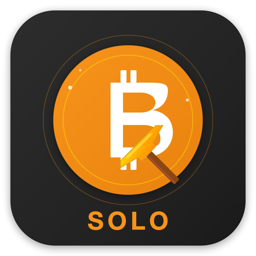
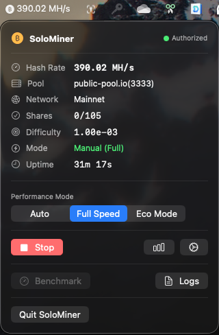
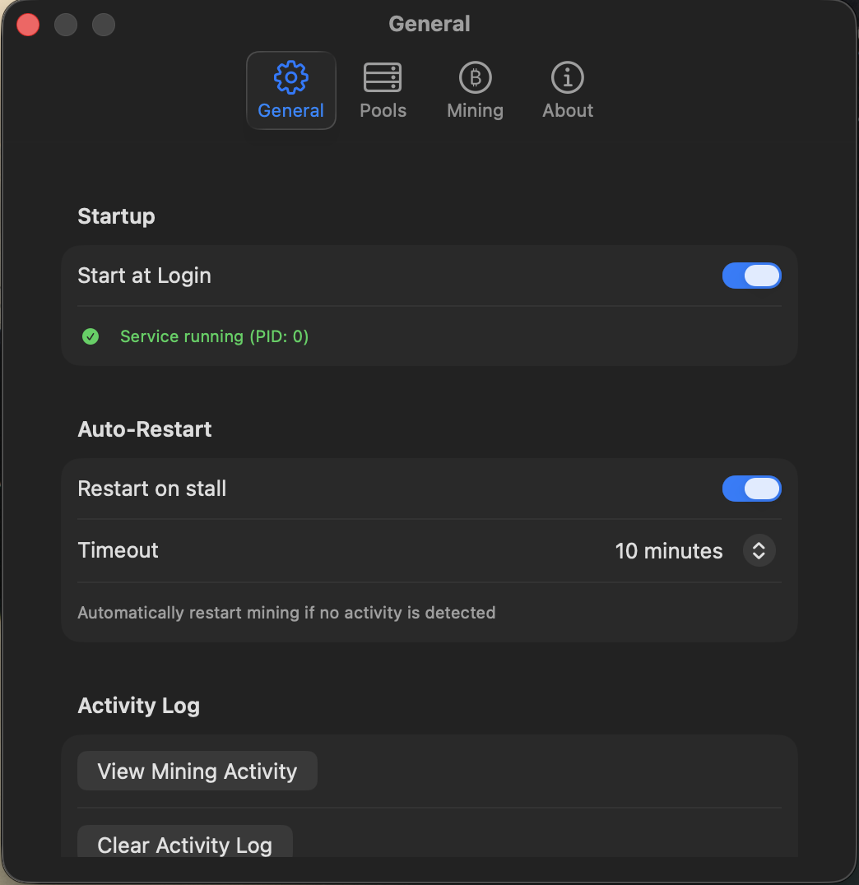
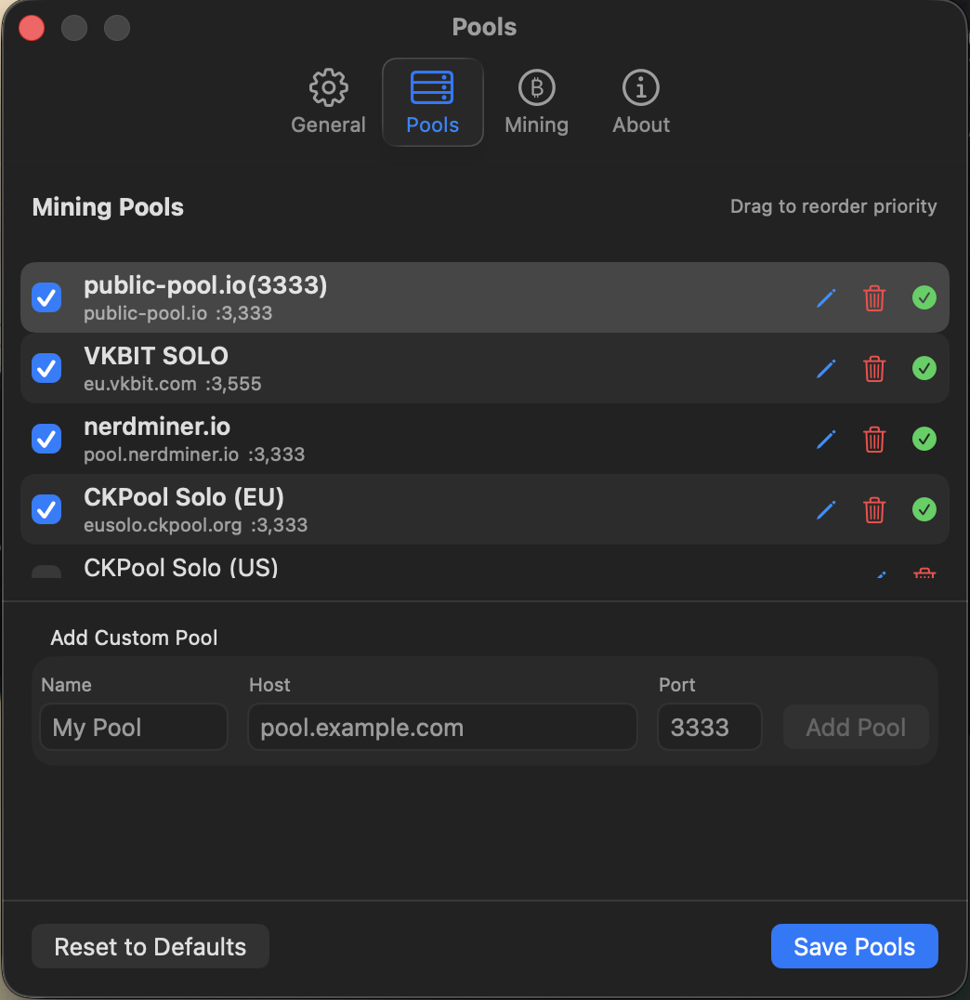
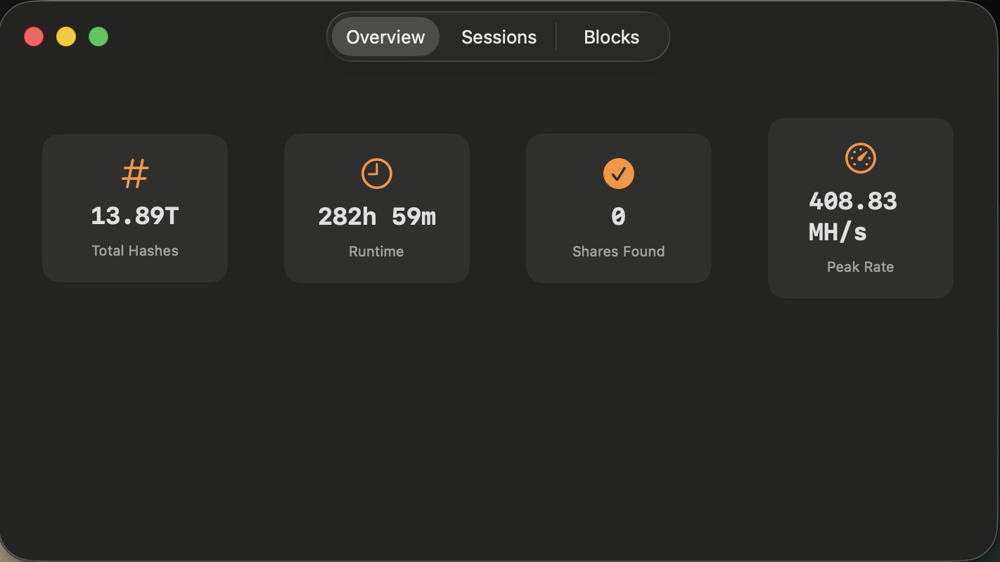
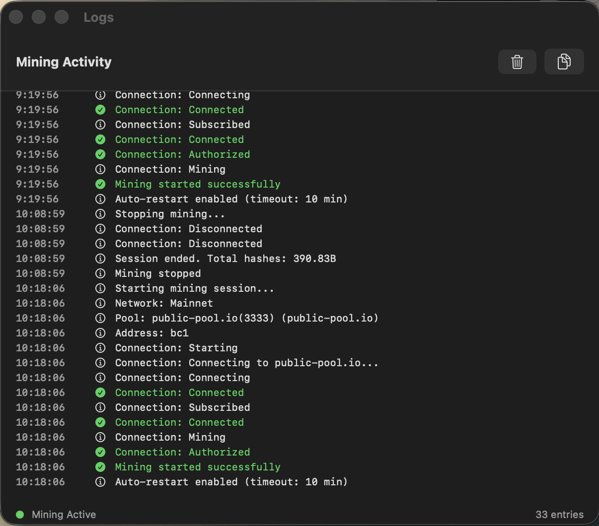

# SoloMiner

<p align="center">
  
</p>

<p align="center">
  <strong>Bitcoin Solo Mining for macOS</strong>
</p>

<p align="center">
  A native macOS menu bar application for solo Bitcoin mining using Metal GPU acceleration.
</p>

---

## Overview

SoloMiner is a lightweight, native macOS application that enables solo Bitcoin mining directly from your Mac's menu bar. It uses Apple's Metal framework for GPU-accelerated SHA-256 hashing and connects to mining pools via the Stratum v1 protocol.

**Important:** Solo mining is essentially a lottery. The probability of finding a block with consumer hardware is extremely low, but the reward is the full block reward (~3.125 BTC). This app is for educational purposes and lottery-style mining enthusiasts.

## Features

- **Menu Bar App** - Runs quietly in your menu bar with real-time hashrate display
- **Metal GPU Mining** - Hardware-accelerated SHA-256 using Apple's Metal framework
- **Multi-Pool Support** - Connect to any Stratum v1 compatible pool
- **Smart Throttling** - Automatically adjusts performance based on system activity and power state
- **Auto-Restart** - Automatically restarts mining if the connection stalls
- **Statistics Tracking** - Track hashrate, shares, uptime, and mining history
- **Native macOS** - Built with SwiftUI for a seamless macOS experience

## Screenshots

### Menu Bar View

*Main mining interface accessible from the menu bar*

### Settings - General

*Configure startup options and auto-restart settings*

### Settings - Pools

*Manage mining pools with edit, delete, and priority ordering*

### Settings - Mining

*Configure network and payout address*

### Statistics

*View mining statistics and history*

### Logs

*Real-time mining activity log*

## Installation

1. Download the latest `SoloMiner.app.zip` from the [Releases](https://github.com/error2/SoloMiner/releases) page
2. Unzip and move `SoloMiner.app` to your Applications folder
3. Right-click the app and select "Open" (required for first launch of unsigned apps)
4. Configure your Bitcoin address in Settings

## System Requirements

- macOS 14.0 (Sonoma) or later
- Apple Silicon Mac (M1/M2/M3) or Intel Mac with Metal-capable GPU
- Internet connection

## Configuration

### Configuration File Location
```
~/Library/Application Support/SoloMiner/config.json
```

### Sample Configuration
```json
{
  "network": "mainnet",
  "stratum": {
    "host": "solo.ckpool.org",
    "port": 3333,
    "workerName": "solominer"
  },
  "mining": {
    "payoutAddress": "bc1q...",
    "workerName": "solominer"
  },
  "pools": [
    {
      "name": "CKPool Solo",
      "host": "solo.ckpool.org",
      "isEnabled": true,
      "priority": 0
    },
    {
      "name": "Public Pool",
      "host": "public-pool.io",
      "port": 21496,
      "isEnabled": false,
      "priority": 1
    }
  ],
  "throttle": {
    "enableAutoThrottle": true,
    "maxGpuUsage": 80,
    "ecoModeBatchExponent": 20,
    "fullModeBatchExponent": 24
  }
}
```

### Configuration Options

| Option | Description |
|--------|-------------|
| `network` | Bitcoin network: `mainnet` or `testnet` |
| `stratum.host` | Default pool hostname |
| `stratum.port` | Pool port (default varies by pool) |
| `mining.payoutAddress` | Your Bitcoin address for block rewards |
| `pools` | List of mining pools with priority ordering |
| `throttle.enableAutoThrottle` | Auto-adjust performance based on system state |
| `throttle.maxGpuUsage` | Maximum GPU usage percentage |

### Supported Pools

SoloMiner works with any Stratum v1 compatible solo mining pool:

| Pool | Host | Port | Notes |
|------|------|------|-------|
| CKPool Solo | `solo.ckpool.org` | 3333 | Popular solo mining pool |
| Public Pool | `public-pool.io` | 21496 | Community solo pool |

## Performance Modes

SoloMiner includes intelligent throttling to balance mining performance with system usability:

| Mode | Description |
|------|-------------|
| **Auto** | Automatically adjusts based on user activity and power state |
| **Full** | Maximum hashrate, may affect system responsiveness |
| **Eco** | Reduced hashrate, minimal system impact |

## Auto-Restart

The auto-restart feature monitors mining activity and automatically restarts if no activity is detected for the configured timeout period. This helps recover from:

- Network disconnections
- Pool server issues
- Stratum protocol timeouts

Configure the timeout in Settings > General > Auto-Restart (default: 5 minutes).

## Building from Source

This repository contains only the compiled application. The source code is not publicly available.

## Disclaimer

- **Solo mining is a lottery.** With consumer hardware, the probability of finding a block is extremely low.
- **Not financial advice.** Use at your own risk.
- **Electricity costs.** Mining uses significant power; calculate your costs.
- **Not affiliated** with any mining pool or Bitcoin project.

## License

This application is provided as-is for personal use. All rights reserved.

## Support

For issues or feature requests, please open an issue on GitHub.

---

<p align="center">
  Made with Metal and SwiftUI for macOS
</p>
